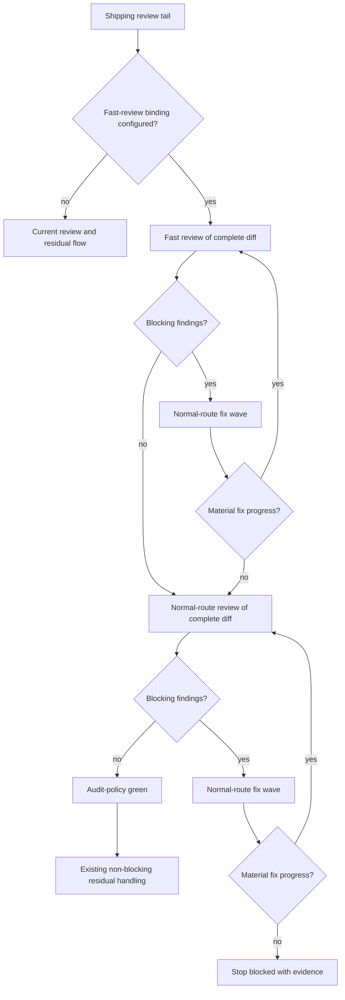
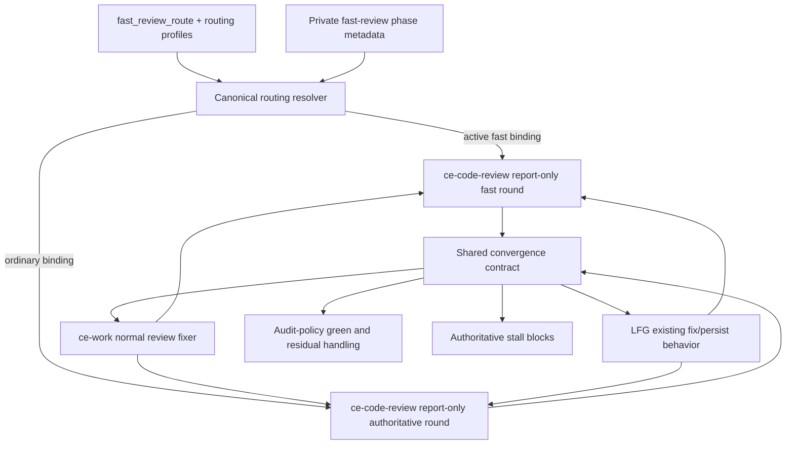

# Phased Review Convergence - Plan

## Goal Capsule

- **Objective:** Let `ce-work` and LFG clear straightforward review findings through a high-throughput route before the normally configured review route performs the authoritative audit and drives the release to audit-policy green.
- **Authority:** The Product Contract governs phase behavior. Existing audit policy governs which findings block progress, while existing routing policy governs profile availability and fallback.
- **Stop conditions:** Stop when authoritative review cannot make material progress on a blocking finding, a required route cannot run, or implementation would change reviewer content or fixer ownership.
- **Execution profile:** Add the frozen fast-review binding first, then expose it to review before integrating the shared convergence loop into `ce-work` and LFG.
- **Tail ownership:** `ce-work` retains its attended shipping tail and LFG retains its autonomous commit, push, PR, and CI tail.
- **Open blockers:** None.

---

## Product Contract

### Summary

Add an opt-in two-phase review convergence loop to `ce-work` and LFG.
A configurable fast-review route pre-clears findings, then ordinary review routing performs fresh repeated audits until the release is green under the active audit policy.

### Problem Frame

The current shipping tails run one code review, apply eligible findings, and then handle any residuals without requiring another audit.
Sending the first pass directly to a high-compute route increases wall-clock latency and compute use even when many findings are straightforward enough for a higher-throughput reviewer.
Users can route review roles to different profiles, but static role and class bindings cannot express a fast pre-clearance phase followed by an authoritative high-compute phase in the same workflow.

### Key Decisions

- **Use a quality-gated two-phase loop.** Each phase advances only when the active audit policy considers it green, rather than after a fixed number of rounds. (session-settled: user-directed — chosen over a two-round handoff: productive review and fix rounds should continue until they satisfy the release bar.)
- **Treat normal review as the authoritative audit.** The normal-route phase reviews the complete post-fast-phase diff instead of reviewing only findings the fast phase could not resolve. (session-settled: user-approved — chosen over unresolved-finding escalation: the stronger reviewer should independently catch subtle or interacting defects.)
- **Configure fast review separately.** A dedicated fast-review binding selects the early execution profile, while the final phase returns to ordinary review role and class resolution. (session-settled: user-directed — chosen over reusing the implementation route or hardcoding Terra: review execution should remain configurable without coupling it to repair execution.)
- **Keep repair on the normal fix route.** Both phases apply findings through the existing review-fixer routing rather than moving final repairs onto the review profile. (session-settled: user-directed — chosen over phase-matched fixers: higher-compute review should identify hard issues without spending the same route on routine edits.)
- **Allow unlimited productive rounds with bounded stall behavior.** A materially progressing fast phase has no fixed round cap; a stalled fast blocker escalates early to normal review, while a stalled normal-review blocker stops the workflow with evidence. (session-settled: user-directed — chosen over a fixed retry budget or indefinite no-progress retries: useful work should continue without allowing autonomous runs to loop forever.)
- **Make phased convergence opt-in.** When no fast-review binding is configured, `ce-work` and LFG retain their current review and residual behavior. (session-settled: user-directed — chosen over enabling a built-in fast phase by default: existing users should not receive extra review rounds without configuration.)

### Actors

- A1. **Configuring user:** Selects a reusable execution profile and policy for fast review.
- A2. **Shipping orchestrator:** Runs `ce-work` or LFG, owns phase transitions, invokes review, applies findings, and determines whether progress continues.
- A3. **Reviewer panel:** Uses the existing CE-selected personas and review contract through either the fast binding or ordinary review routing.
- A4. **Review fixer:** Applies eligible findings through its normal implementation-class route and returns evidence of changes or a reason for no change.

### Requirements

**Activation and routing**

- R1. `ce-work` and LFG must enable phased review convergence only when a dedicated fast-review binding is effective for the run.
- R2. The fast-review binding must select a reusable execution profile and preserve the configured route policy for availability, fallback, and identity verification.
- R3. Fast-phase routing must change only reviewer execution and must not change reviewer roles, personas, prompts, tools, permissions, roster selection, or mutation posture.
- R4. Review fixes in both phases must use the normal review-fixer route rather than inheriting the active reviewer profile.
- R5. The authoritative phase must resolve reviewers through the ordinary review role and class configuration, including role-specific exceptions.
- R6. When no fast-review binding is configured, both callers must preserve their existing one-pass review and residual behavior.

**Fast pre-clearance**

- R7. The fast phase must review the complete current diff and pass every eligible actionable finding to the existing caller-owned fix flow.
- R8. After a material fix wave, the fast phase must review the resulting complete diff again until the active audit policy reports no blocking findings.
- R9. Productive fast review and fix rounds must not stop because of a fixed round count.
- R10. A fast phase that repeats the same blocking finding without material repair progress must hand off early to the authoritative phase with the unresolved evidence preserved.

**Authoritative convergence**

- R11. The authoritative phase must begin with a fresh review of the complete post-fast-phase diff, even when fast review reported no blocking findings.
- R12. The authoritative phase must pass every eligible actionable finding to the normal fix flow and re-review the complete materially changed diff.
- R13. The authoritative phase must repeat review and fix rounds until the active audit policy reports no blocking findings.
- R14. An authoritative phase that repeats a blocking finding without material repair progress must stop the workflow as blocked and surface the finding, attempted fix, and non-progress evidence.
- R15. Findings that the active audit policy marks non-blocking must follow the existing residual handling and must not prevent either phase from being green unless they are promoted.

**Workflow consistency and transparency**

- R16. `ce-work` and LFG must use the same phase transitions, green condition, progress condition, and stall semantics while preserving their attended and autonomous interaction contracts.
- R17. LFG must execute the loop without prompting and must not convert a blocking authoritative stall into an accepted residual.
- R18. User-visible output must distinguish fast and authoritative review rounds, report why each phase advanced or stopped, and retain the normal requested-versus-served route receipts.
- R19. A review or fix route failure must retain the owning route policy's existing blocker or fallback behavior and must not be treated as audit-policy green.

### Key Flows

- F1. **Opt-in activation:** A1 configures the fast-review binding; A2 enters the review tail; A2 starts fast review before ordinary review routing.
- F2. **Fast convergence:** A3 reports blocking findings; A4 makes material repairs; A2 re-runs fast review on the complete diff until the active audit policy is green.
- F3. **Fast stall escalation:** A4 cannot materially change a repeated blocking finding; A2 preserves the evidence and starts the authoritative phase before fast review is green.
- F4. **Authoritative convergence:** A3 performs a fresh normal-route audit; A4 applies eligible findings; A2 repeats the complete audit after each material fix wave until no blockers remain.
- F5. **Authoritative stall:** A4 cannot materially change a repeated authoritative blocker; A2 stops shipping and reports the non-progress evidence.
- F6. **Compatibility path:** No fast-review binding is effective; A2 follows the existing review, fix, and residual behavior without adding a second phase.

### Acceptance Examples

- AE1. **Covers R1-R6.** Given no fast-review binding, when `ce-work` or LFG reaches code review, then it follows the current one-pass behavior without an added convergence loop.
- AE2. **Covers R1-R5, R7.** Given a configured fast-review profile and ordinary review role overrides, when phased review starts, then fast reviewers use the dedicated profile, fixers use their normal implementation route, and final reviewers use the ordinary class and role routes.
- AE3. **Covers R7-R9.** Given fast review continues finding blockers and each fix wave materially changes the cited code, when more than two rounds are needed, then the fast phase continues until it reaches audit-policy green.
- AE4. **Covers R10-R11.** Given a fast blocker repeats after a fix attempt with no material progress, when the stall is detected, then the workflow preserves the blocker evidence and immediately performs a fresh authoritative audit of the complete diff.
- AE5. **Covers R11-R13.** Given fast review reports no blockers, when the authoritative phase begins, then it still reviews the complete diff and repeats after material fixes until its own audit is green.
- AE6. **Covers R14, R17.** Given an authoritative blocker repeats without material repair progress in LFG, when the stall is detected, then LFG stops as blocked without prompting or accepting the blocker as residual work.
- AE7. **Covers R15.** Given only non-blocking P2 or P3 findings remain under the active workspace audit policy, when a phase evaluates its result, then it may become green and sends those findings through existing fix or durable residual handling.
- AE8. **Covers R16, R18.** Given equivalent review outputs in `ce-work` and LFG, when their loops complete, then both report the same phase transitions and green reason while retaining their normal interaction style and route receipts.
- AE9. **Covers R19.** Given a required fast or authoritative review route is unavailable, when that round would start, then the workflow reports the route blocker and does not treat the skipped audit as green.

### Success Criteria

- Straightforward findings can be discovered and repaired through the configured high-throughput review profile before ordinary high-compute review begins.
- The authoritative review profile performs fewer avoidable rounds without lowering the final audit-policy release bar.
- No configured run ships with an unresolved audit-policy blocker after authoritative review stalls or fails.
- Existing users who do not configure fast review receive no additional review rounds or routing changes.
- Review phase, progress, green, escalation, and stall outcomes remain visible in attended and autonomous runs.

### Scope Boundaries

- This work does not add arbitrary phase sequences or transition predicates for planning, research, verification, optimization, or other role classes.
- This work does not hardcode Terra, Sol, or any provider-specific model name into workflow behavior.
- This work does not change `ce-code-review` from report-only review into a mutation-owning workflow.
- This work does not change reviewer persona selection, review depth, finding priority, confidence, or autofix classification.
- This work does not change the active audit policy or redefine which priorities block completion.
- This work does not route fixers through the fast or authoritative review profile.
- This work does not require zero non-blocking findings before a release is audit-policy green.

### Dependencies And Assumptions

- The existing review result remains machine-readable enough for callers to identify blocking findings and reconcile repeated findings across rounds.
- The existing caller-owned review-fix flow can report whether an attempted fix produced a material change.
- The active audit policy remains available to both `ce-work` and LFG and may promote findings that are normally non-blocking.
- Existing routing profiles, policies, serving-identity checks, and receipts remain authoritative for each dispatched reviewer or fixer.

### Sources And Research

- `docs/plans/2026-07-25-001-feat-compound-engineering-routing-global-settings-plan.md` defines execution profiles, class and role bindings, deterministic routing, and unchanged CE content authority.
- `skills/ce-work/references/shipping-workflow.md` defines the current review, fix, and residual tail.
- `skills/ce-work/references/review-findings-followup.md` defines caller-owned repair, review rerun limits, and normal review-fixer dispatch.
- `skills/lfg/SKILL.md` defines LFG's current review, repair, and autonomous residual handoff.
- `scripts/routing/dispatch-roles.json` classifies `ce-work.review-fixer` as implementation work.
- `scripts/routing/config-resolver.py` defines the current profile, class, and role routing grammar without workflow-phase bindings.

Product Contract unchanged during planning.

---

## Planning Contract

### Key Technical Decisions

- KTD1. **Add `fast_review_route` as a nullable profile binding.** The setting accepts `{ profile, policy }`, resolves project over global, validates the referenced profile against merged `routing.profiles`, and remains disabled when absent or null. This is narrower than adding arbitrary phase bindings under `routing` and preserves the Product Contract's opt-in behavior. (session-settled: user-directed — chosen over reusing the implementation route or hardcoding Terra: the pre-clearance route must be independently configurable.)
- KTD2. **Carry fast-review selection as private role-instance metadata.** `ce-code-review` requests `routing_phase: fast-review` only for review-class roles it already selected. The resolver applies the frozen fast binding after authenticated task intent and before ordinary role/class bindings; roles, prompts, roster, tools, permissions, concurrency, and mutation posture remain unchanged.
- KTD3. **Freeze fast review with the existing compatibility snapshot.** Treat `fast_review_route` as recipient-bearing compatibility state so nested review rounds reuse one authenticated snapshot and source provenance. Do not reread live configuration or inject a caller-created task intent between phases.
- KTD4. **Keep `ce-code-review` report-only and make phase state additive.** Add an internal `review_phase:fast-if-configured` control token and return `review_phase.requested` plus `review_phase.active` in `mode:agent` JSON and `review.json`. Ordinary review omits the token and preserves current output semantics apart from the additive field.
- KTD5. **Define green from finalized current findings.** A completed review is green when it has no current P0/P1 finding except preference-grade `settled_conflict` findings. Pre-existing findings do not block the loop; P2/P3 findings remain eligible for repair or residual handling unless active instructions explicitly promote them.
- KTD6. **Define progress from blocker-directed retained changes.** A fix wave makes material progress when it changes the reviewed tree to address at least one current blocker and required targeted verification passes. No blocker-directed change, an unchanged diff, or a repeated blocker/diff fingerprint is a stall; process liveness or agent output volume is not progress.
- KTD7. **Share one convergence contract through generated parity, not a new public skill.** Add byte-identical `review-convergence.md` references under `ce-work` and LFG with a parity test. Each caller supplies its existing fix and persistence behavior while using the same phase transitions, blocker predicate, progress rule, and terminal outcomes.
- KTD8. **Preserve the exact compatibility branch.** The first review requests fast-if-configured. When its result reports the binding inactive, the caller immediately returns to today's one-pass review, fix, and residual flow without an authoritative second phase. (session-settled: user-directed — chosen over enabling a built-in fast phase by default: unconfigured users must receive no added rounds.)
- KTD9. **Keep security work proportional.** Preserve trusted config provenance, frozen snapshots, route-policy enforcement, and opaque OpenCode handles because they are existing dispatch invariants. Do not add a new threat model, credential mechanism, or speculative hardening unrelated to phase selection and convergence correctness.

### High-Level Technical Design

The first configured review pins the diff base and the frozen routing snapshot. Every retained fix invalidates the prior audit and starts a fresh complete-diff review with a new review run ID and artifact path. Fast review may repeat while blocker-directed changes continue; a fast stall starts authoritative review, while an authoritative stall is terminal.

### Implementation Constraints

- Edit canonical routing assets under `scripts/routing/`, then run `bun run routing:sync`; never hand-edit generated consumer copies.
- `fast_review_route` is recipient-bearing configuration and must reject unknown profiles or untrusted project authority using the existing resolver diagnostics.
- The private phase marker may apply only to `ce-code-review` roles in the review class. Classifiers, researchers, validators, and fixers continue through ordinary routing.
- OpenCode phase preparation must remain handle-bound and must not place snapshots, bindings, selectors, or phase control text in reviewer prompts.
- The complete local diff from one pinned base is reviewed every round. A retained P2/P3 fix also invalidates the audit and requires another review before green.
- Existing fix eligibility remains caller-specific: `ce-work` keeps its bias-to-act policy and LFG keeps its autonomous mechanical bar.
- Intermediate fixes are preserved if a later round blocks; the workflow reports them and never rolls back user work.
- Skill prose changes require structural contract tests and a fresh-context behavioral evaluation when the repository's skill-evaluation tooling is available.

### Sequencing

1. Add and test the setting, frozen phase resolution, and OpenCode preparation metadata.
2. Expose fast-if-configured phase control and additive phase output in `ce-code-review`.
3. Add the byte-identical convergence contract and integrate `ce-work` first.
4. Integrate LFG against the same transitions while retaining its autonomous persistence behavior.
5. Update user configuration and skill documentation, synchronize generated assets, then run focused and broad validation.

### System-Wide Impact

- **Configuration:** One opt-in recipient-bearing setting references existing execution profiles.
- **Routing:** Reviewer execution may use a phase binding, but ordinary task, role, class, fallback, identity, and receipt behavior remains intact.
- **Review:** `ce-code-review` gains private phase intake and additive JSON metadata but remains report-only.
- **Shipping:** `ce-work` and LFG gain repeated complete-diff review/fix loops only when fast review is active.
- **Artifacts:** Every round keeps its own `run_id` and review artifact; callers retain enough phase and transition context to explain convergence or blockage.
- **Distribution:** Canonical resolver and schema changes propagate to every independently installable skill and converted target through the existing asset generator.

### Risks And Dependencies

- **False progress:** Unrelated or non-blocking edits could hide a stuck blocker. Require blocker-directed changed-tree evidence and verification before repeating the same phase.
- **Stale audit:** Any retained fix makes the prior review obsolete. Re-run complete-diff review before declaring green.
- **Caller drift:** `ce-work` and LFG could interpret the same result differently. Keep the convergence references byte-identical and test the shared transition vocabulary.
- **Routing leakage:** A phase marker could accidentally affect validators or fixers. Restrict it to `ce-code-review` review-class roles and test ordinary role restoration.
- **Compatibility regression:** An absent setting could add latency or alter residual handling. Keep an explicit legacy branch and test it independently.

### Sources And Research

- `docs/solutions/skill-design/git-workflow-skills-need-explicit-state-machines.md` supports explicit transition and terminal-state contracts for autonomous workflow changes.
- `docs/solutions/skill-design/dispatch-script-failure-degrade-outcome-not-boundary.md` supports preserving route boundaries when a fast dispatch fails or stalls.
- `docs/solutions/skill-design/cli-output-buffering-for-progress-detection.md` distinguishes process liveness from material workflow progress.
- `docs/solutions/best-practices/ce-pipeline-end-to-end-learnings.md` supports structural workflow tests and caller-owned fix policy.
- `skills/ce-code-review/references/finish-review.md` provides finalized current, pre-existing, severity, settlement-conflict, and actionable finding partitions.
- `.opencode/plugins/ce-routing-adapter.js` and `.opencode/plugins/compound-engineering.js` own OpenCode selected-wave preparation and opaque handle transport.

---

## Implementation Units

### U1. Fast-review configuration and frozen routing

- **Goal:** Add the opt-in fast-review profile binding and resolve it safely for selected code-review roles across native and converted runtimes.
- **Requirements:** R1-R6, R18-R19; KTD1-KTD3, KTD8-KTD9.
- **Dependencies:** None.
- **Files:** `scripts/routing/settings-schema.json`, `scripts/routing/config-resolver.py`, `scripts/routing/protocol-schema.json` when the role-instance contract needs documentation, `.opencode/plugins/compound-engineering.js`, `.opencode/plugins/ce-routing-adapter.js`, `skills/ce-setup/references/config-template.yaml`, `.compound-engineering/config.local.example.yaml`, generated `skills/*/scripts/ce-routing.py`, generated `skills/*/references/ce-routing-schema.json`, `tests/routing-config-contract.test.ts`, `tests/routing-resolver.test.ts`, `tests/routing-assets-parity.test.ts`, `tests/skills/opencode-routing-adapter.test.ts`.
- **Approach:** Register `fast_review_route` as nullable recipient-bearing profile/policy data, include it in frozen compatibility state, and validate profile references after routing profile merge. Accept one enumerated fast-review marker in role-instance metadata and resolve the dedicated binding only for `ce-code-review` review-class roles. Extend OpenCode `ce_task_prepare` with the same optional enum and return whether the configured phase was active; keep opaque handle execution unchanged.
- **Test scenarios:** Absent and null settings disable fast review; valid global and project bindings resolve with correct provenance; project override wins; unknown profiles and untrusted recipient authority fail; authenticated task intent remains higher precedence; the marker is rejected outside code-review review roles; fast binding resolution leaves role/class/instance identity intact; ordinary resolution restores role-specific exceptions; parent snapshots freeze the original binding across config changes; OpenCode preparation binds phase state to the handle without prompt leakage.
- **Verification:** Focused resolver, schema, generated-asset, and OpenCode adapter tests pass before consumer prose changes begin.

### U2. Report-only fast review control and output

- **Goal:** Let callers request fast review when configured and learn whether the phase was active without changing review content or mutation ownership.
- **Requirements:** R3-R5, R7-R8, R11, R18-R19; KTD2-KTD5.
- **Dependencies:** U1.
- **Files:** `skills/ce-code-review/SKILL.md`, `skills/ce-code-review/references/cross-model-review.md`, `skills/ce-code-review/references/dispatch-reviewers.md`, `skills/ce-code-review/references/finish-review.md`, `skills/ce-code-review/references/review-output-template.md`, `tests/review-skill-contract.test.ts`, `tests/skills/ce-code-review-cross-model-routes.test.ts`, `tests/skills/ce-routing-native-dispatch.test.ts`.
- **Approach:** Parse and strip `review_phase:fast-if-configured` as a private programmatic token allowed only with `mode:agent`. Pass fast-review instance metadata at the existing adversarial and local reviewer routing gates, reuse one frozen snapshot, and return additive `review_phase` metadata in the primary JSON and `review.json`. Keep finalized `findings` as the source for P0/P1 blocker classification; do not move fix or green judgment into the review skill.
- **Test scenarios:** The private token conflicts with human/default and local-apply modes; absent binding reports inactive and resolves ordinarily; active binding covers every selected review role including adversarial review; classifiers, validators, and conditional non-review workers remain ordinary; prompts and persona assets do not receive the token; `mode:agent` remains one raw JSON object and report-only; ordinary calls remain compatible; phase metadata matches the prepared binding outcome.
- **Verification:** Review contract and routing-site tests prove only execution selectors and receipts change between fast and ordinary rounds.

### U3. Shared convergence loop in `ce-work` and LFG

- **Goal:** Drive both shipping callers through fast pre-clearance and authoritative review until audit-policy green without losing their distinct fix and persistence contracts.
- **Requirements:** R6-R19; F1-F6; AE1-AE9; KTD4-KTD8.
- **Dependencies:** U1-U2.
- **Files:** `skills/ce-work/references/review-convergence.md` (new), `skills/lfg/references/review-convergence.md` (new, byte-identical), `skills/ce-work/references/shipping-workflow.md`, `skills/ce-work/references/review-findings-followup.md`, `skills/lfg/SKILL.md`, `skills/lfg/references/review-followup.md`, `tests/pipeline-review-contract.test.ts`, `tests/review-convergence-parity.test.ts` (new).
- **Approach:** Define one explicit transition table over legacy, fast, authoritative, green, and blocked states. Pin one diff base; classify finalized current P0/P1 findings as blockers; fingerprint blockers by normalized file, line bucket, and title; require blocker-directed retained diffs plus verification as material progress; and detect repeated diff/finding states. Load the contract from both callers, preserve their existing fixer eligibility and persistence behavior, and send only final authoritative non-blockers to residual handling.
- **Test scenarios:** No binding performs exactly one legacy pass; fast green always triggers fresh authoritative review; more than two productive fast or authoritative rounds continue; a retained non-blocking fix triggers re-review; fast no-progress escalates with evidence; authoritative no-progress blocks; failed/degraded/skipped review never becomes green; P2/P3-only output reaches residual handling; a promoted lower-priority finding blocks; route failure follows existing policy; interrupted work restarts review from the current tree rather than replaying fixes; `ce-work` may ask only at its existing residual gate and LFG never prompts.
- **Verification:** Contract tests prove parity and every transition; fresh-context behavioral evaluations cover configured convergence, compatibility, fast stall, authoritative stall, and LFG no-prompt behavior.

### U4. User documentation and integrated validation

- **Goal:** Document activation and observable behavior, then prove native and converted distribution stays coherent.
- **Requirements:** R1-R6, R16-R19; KTD1, KTD7-KTD9.
- **Dependencies:** U1-U3.
- **Files:** `docs/skills/configuration.md`, `docs/skills/ce-work.md`, `docs/skills/lfg.md`, `docs/skills/ce-code-review.md`, `CONCEPTS.md`, `README.md` only if its workflow summary would otherwise become inaccurate.
- **Approach:** Add a concise configuration example using an existing profile, define phase precedence and disabled behavior, explain that fixers retain normal implementation routing, and document phase/green/stall output. Keep security guidance limited to existing routing and credential boundaries.
- **Test scenarios:** Documentation examples match the schema; setup templates remain byte-identical; configuration inspection exposes value and provenance; release validation sees no stale generated assets or metadata drift.
- **Verification:** Run routing parity, focused workflow tests, full `bun test`, `bun run release:validate`, and `bun run plugin:validate` when the repository-pinned `claude` CLI is available.

---

## Verification Contract

| Gate | Command | Proves |
|---|---|---|
| Routing and config | `bun test tests/routing-config-contract.test.ts tests/routing-resolver.test.ts tests/routing-assets-parity.test.ts tests/skills/opencode-routing-adapter.test.ts` | Setting validation, frozen phase routing, generated parity, and OpenCode preparation. |
| Review contract | `bun test tests/review-skill-contract.test.ts tests/skills/ce-code-review-cross-model-routes.test.ts tests/skills/ce-routing-native-dispatch.test.ts` | Report-only phase control, output shape, and unchanged reviewer boundaries. |
| Convergence callers | `bun test tests/pipeline-review-contract.test.ts tests/review-convergence-parity.test.ts` | Legacy compatibility, loop transitions, stalls, green, and caller parity. |
| Generated assets | `bun run routing:check` | Canonical routing changes reached every consumer. |
| Full suite | `bun test` | Repository-wide mechanical and behavioral contracts remain green. |
| Release metadata | `bun run release:validate` | Plugin and marketplace assets remain coherent. |
| Plugin schema | `bun run plugin:validate` | Claude plugin and marketplace validation pass when the pinned CLI is available. |

Behavioral skill evaluation is required for the configured and unconfigured caller flows because deterministic prose tests cannot prove model adherence to an uncapped convergence loop. Record the active host/model and any unavailable evaluation tooling rather than substituting an ad hoc prompt test.

---

## Definition of Done

- `fast_review_route` can select the configured high-throughput profile without changing reviewer identity, content, tools, permissions, or fixer routing.
- `ce-code-review mode:agent review_phase:fast-if-configured` reports active or inactive phase state and remains report-only.
- `ce-work` and LFG use the same convergence transitions, continue every productive round, escalate a fast stall, and block an authoritative stall.
- Every materially changed reviewed diff receives a fresh complete-diff review before green.
- P0/P1 blockers cannot enter residual handling, while non-blocking findings retain existing fix or durable residual behavior.
- An absent setting preserves the current one-pass review path.
- Focused tests, routing parity, the full test suite, and release validation pass; plugin validation or behavioral evaluation is reported explicitly if unavailable.
- User-facing configuration and skill documentation matches implemented behavior.
- No abandoned phase framework, alternate fixer path, temporary debug code, or generated-asset drift remains in the final diff.
